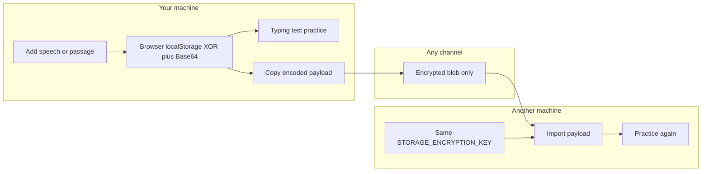

# Local Type Test

> **Local-only encrypted typing practice** — store speeches and sensitive passages in your browser, practice with a built-in typing test, and move content as opaque encoded strings. Plaintext never leaves your machine through this app.

[](https://nextjs.org/)
[](https://react.dev/)
[](https://www.typescriptlang.org/)
[](https://mantine.dev/)

**Local Type Test** is a self-hosted, offline-friendly **typing test** for people who need to rehearse confidential material without sending it to cloud services in plain text. Run it on your laptop, a home server, or anywhere you can start a local Next.js app. Add passages, practice typing, **copy encoded exports**, and **import** them on another machine using the same encryption key — a practical way to transfer sensitive speeches, scripts, legal drafts, and internal copy while keeping rehearsal local-first and private.

Looking for a **local typing test**, **encrypted typing practice**, or a way to **practice speeches privately**? This project combines keyboard practice with key-protected storage so you can sync material through everyday channels (chat, email, notes) as ciphertext-like payloads, not readable text.

## Table of contents

- [Why this exists](#why-this-exists)
- [Who is this for?](#who-is-this-for)
- [Features](#features)
- [How it works](#how-it-works)
- [Security notes](#security-notes)
- [Quick start](#quick-start)
- [Environment variables](#environment-variables)
- [Usage: export and import encoded text](#usage-export-and-import-encoded-text)
- [Tech stack](#tech-stack)
- [Development](#development)

## Why this exists

Most online typing sites and shared documents expect your passage in **plaintext**. That is fine for public quotes — not for confidential keynotes, unreleased scripts, client work, or anything that should not sit on someone else’s server.

**Local Type Test** gives you:

- A **local encrypted typing test** experience: passages live in **your browser**, encoded with a secret you control.
- A familiar **typing test** UI to build muscle memory before the real delivery.
- **Portable encoded blobs** you can copy and paste anywhere; only instances configured with the **same key** can decode and import them.

No cloud text library. No third-party analytics on what you are practicing. You host it; you hold the keys.

## Who is this for?

- **Speakers and presenters** rehearsing talks that are not public yet  
- **Writers and editors** drilling long passages without pasting them into random websites  
- **Legal, compliance, and security-minded teams** who want **offline typing practice** on controlled hardware  
- **Anyone** who needs a **self-hosted typing test** and a simple, copy-paste workflow to move **sensitive text** between machines  

## Features

| Feature | Description |
| -------- | ------------- |
| Password-protected shell | Sign in with `APP_PASSWORD`; routes guarded by Next.js `proxy` |
| Text library | Create, edit, and delete titled passages |
| Typing test | Character-by-character practice with timing and mistake tracking |
| Copy encoded export | One-click payload for a single passage (title + content) |
| Import encoded text | Paste a payload to add a passage to your library |
| Logout | Clears the session cookie on this browser |

## How it works



1. You set **`STORAGE_ENCRYPTION_KEY`** in the environment. The app uses it for all encode/decode operations in the browser.
2. Your **library** is stored in `localStorage` as an encoded blob — not raw JSON plaintext.
3. **Export:** the copy action produces a Base64 string encoding `{ title, content }` with your key.
4. **Import:** paste that string on another instance with the **identical** key; the passage is decoded and added to the library.
5. **`APP_PASSWORD`** is separate: it only locks access to the app UI on that host, not the mathematical encoding of payloads.

Encoding implementation: UTF-8 → repeating-key XOR → Base64 (`utils/storage.ts`).

## Security notes

Read this before trusting the tool with high-stakes material.

- **Local-only storage:** Passage content is not sent to a backend API for storage. It stays in the browser’s `localStorage` (encoded).
- **Two secrets, two jobs:**
  - `APP_PASSWORD` — gate for opening the app on a given deployment.
  - `STORAGE_ENCRYPTION_KEY` — protects library data and export/import payloads.
- **Encoding, not AES:** Payloads use **shared-secret XOR + Base64**. That keeps plaintext off disks and channels in casual scenarios and matches “copy the encrypted-looking block” workflows. It is **not** high-assurance cryptography. Treat the key like a password: long, random, never committed to git.
- **Sync the key safely:** Use a password manager or secure channel when aligning `STORAGE_ENCRYPTION_KEY` across machines.
- **Do not commit secrets:** Copy [`.env.example`](.env.example) to `.env.local`. Real env files are gitignored.

## Quick start

### Prerequisites

- **Node.js 20+** (LTS recommended)
- **Git**
- **Corepack** (bundled with modern Node) for Yarn 4

### Run locally

```bash
git clone <your-repo-url>
cd local-type-test

corepack enable
yarn install
```

Create your environment file:

```bash
# Unix/macOS/Linux
cp .env.example .env.local

# Windows (PowerShell)
Copy-Item .env.example .env.local
```

Edit `.env.local` and set strong, unique values for both variables (see table below).

Start the dev server:

```bash
yarn dev
```

Open [http://localhost:3000](http://localhost:3000), sign in with your `APP_PASSWORD`, and add your first passage.

### Production build (optional, still local)

```bash
yarn build
yarn start
```

Serve on the same machine or bind to your network only if you understand the exposure; the app password is your primary gate.

## Environment variables

| Variable | Required | Purpose |
| -------- | -------- | ------- |
| `APP_PASSWORD` | Yes | Password for signing into this instance |
| `STORAGE_ENCRYPTION_KEY` | Yes | Shared secret for encoding the library and export/import payloads. **Must match** on every machine that should read your copied blobs |

Example template ([`.env.example`](.env.example)):

```env
APP_PASSWORD=change-me
STORAGE_ENCRYPTION_KEY=change-me-too
```

Replace both with long random strings before use.

## Usage: export and import encoded text

### Daily practice

1. Sign in.
2. Create a text (**+**) with a title and body (speech, script, brief, etc.).
3. Select it and start the **typing test** to practice.
4. Edit or delete from the library sidebar as needed.

### Export (copy encoded passage)

1. In the library, click the **copy** icon on a text.
2. Copy the encoded string from the dialog (clipboard when allowed).
3. Paste into Signal, Slack, email, a file, USB notes — whatever channel you use. Recipients (or future you) only see an opaque block, not the speech.

### Import on another machine

1. Clone or copy this repo on the target machine.
2. Use the **same** `STORAGE_ENCRYPTION_KEY` in `.env.local` (and your chosen `APP_PASSWORD` for that instance).
3. Run `yarn dev` (or `yarn build && yarn start`).
4. Sign in → **Import** → paste the encoded payload → confirm.
5. Select the imported text and practice again.

**Import failed?** Usually a **key mismatch**, a truncated copy, or extra whitespace. Verify the key byte-for-byte and paste the full payload.

## Tech stack

- [Next.js 16](https://nextjs.org/) (App Router, `proxy.ts` for route protection)
- [React 19](https://react.dev/)
- [Mantine 9](https://mantine.dev/)
- TypeScript
- Client-side `localStorage` only — no server-side text database

## Development

| Script | Command | Description |
| ------ | ------- | ----------- |
| Dev | `yarn dev` | Hot reload at `localhost:3000` |
| Build | `yarn build` | Production bundle |
| Start | `yarn start` | Serve production build |
| Lint | `yarn lint` | Oxlint |

Main UI lives under [`app/`](app/). Legacy [`pages/`](pages/) from the template may still exist; the typing product is App Router–based.

**Suggested GitHub repo metadata (manual):** set the repository **Description** to the tagline above and add **Topics** such as `typing-test`, `encryption`, `local-first`, `self-hosted`, `nextjs`, `privacy` for discoverability.

---

-serra
